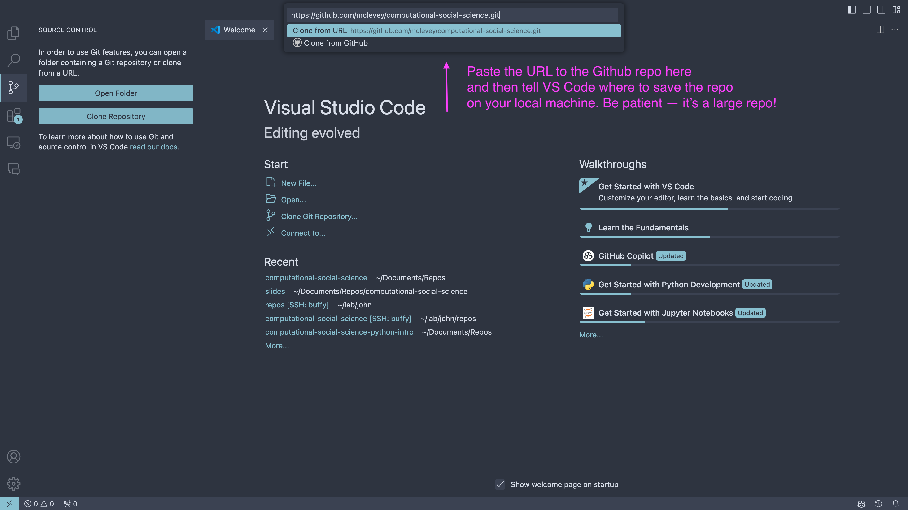

🤗🤗 2024 GESIS Fall Seminar

# Introduction to Computational Social Science with Python

Dr. **John McLevey**<br>University of Waterloo<br>Waterloo, ON, Canada<br>[johnmclevey.com](https://www.johnmclevey.com)<br><john.mclevey@uwaterloo.ca>

Hi! This repository contains a Python package and course materials for my [GESIS Fall Seminar](https://www.gesis.org/en/gesis-training/what-we-offer/fall-seminar-in-computational-social-science) course **Introduction to Computational Social Science with Python**. This course is taught in parallel with Dr. **Johannes Gruber**, who is teaching a similar introductory course in R. You'll find the course overview and details below, along with details instructions on how to setup your computing environment (local or remote) and guidelines if you would like to contribute to course development.

Contents

- [Course Overview and Materials](#course-overview-and-materials)
- [Computing Setup](#computing-setup)
  - Required Software
  - Poetry
  - Poetry + Conda
  - Poetry + Docker
- [Remote Computing](#remote-computing)
  - Google Colab
  - etc.
- [Additional Resources](#additional-resources)
- [Contributing](#contributing)
  - Additional Development Setup
  - Git and Coding Conventions
  - Scripts (Installed in Poetry)
  - `pdpp` Pipelines
- [License](#license)

# Course Description

The Digital Revolution has produced unprecedented amounts of data that are relevant for researchers in the social sciences, from online surveys to social media user data, travel and access data, and digital or digitized text data. How can these masses of raw data be turned into understanding, insight, and knowledge? The goal of this course is to introduce you to Computational Social Science with Python, a powerful programming language that offers a wide variety of tools, used by journalists, data scientists and researchers alike. Unlike many introductions to programming, e.g., in computer science, the focus of this course is on how to explore, obtain, wrangle, visualize, model, and communicate data to address challenges in social science. The course emphasizes the theoretical and ethical aspects of CSS while covering topics such as web scraping (obtaining data from the internet), data cleaning and visualization, computational text analysis, machine learning, network analysis, and agent-based modeling. The course will be held as a blended learning workshop with video lectures focused on theoretical background and demonstrations accompanied by live sessions where students can ask questions and work through projects together.

**Working knowledge of Python is an asset, but is not required.** There is an optional “Introduction to Python” module that you should review before beginning this course.

# Course Schedule

GESIS Fall Seminar in Computational Social Science<br>
August 30 - September 6, 2024

| time  | Session                                      |
|-------|----------------------------------------------|
| Day 1 | Introduction to Computational Social Science |
| Day 2 | Obtaining Data                               |
| Day 3 | Computational Text Analysis                  |
| Day 4 | Computational Network Analysis               |
| Day 5 | Social Simulation & Agent-based Models       |
| Day 6 | Project Work Day and Outlook                 |


# Download the Course Materials

## VS Code

The easiest way to get the course material is to clone this repository. If you aren’t already familiar with git, I recommend doing this via VS Code. Once you've downloaded VS Code and set it up according to the setup guide, you can clone the repo by

1. clicking the "Source Control" button on the left,
2. selecting "Clone Repository",
3. pasting the GitHub repository when prompted by VS Code, and finally
4. selecting a folder on your computer to store the repo.

The screenshots below should help you find what you're looking for if this is your first time doing this.




Once you tell VS Code to open the repo, you're ready to go! You should see the repository contents in the file browser on the left.


## From the Command Line

Alternatively, you can close the repository from the command line.

```zsh
git clone https://github.com/mclevey/computational-social-science.git
cd computational-social-science-python
```

# Required Software

See the [setup guide](setup/setup-guide.md) for detailed instructions on how to setup the required software for this course.

- [VS Code](https://code.visualstudio.com) (text editor / IDE)
- Python 3.11+ (via [Miniconda](https://docs.anaconda.com/miniconda/))
- [Quarto](https://quarto.org)
