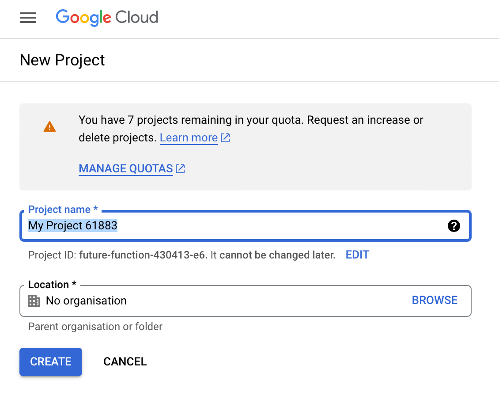
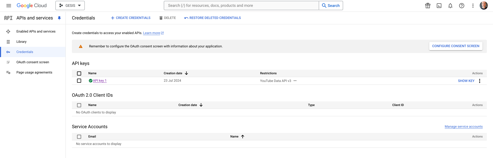

# YouTube Example


To refresh the dependency graph,^[I run this a lot so like it aliased to `pg`.]

```zsh
pdpp graph --files png --style default
```

## Get a YouTube API Key

### Google Account, Google Cloud Console

Sign up for a Google account if you don't already have one. Next, open the [Google Cloud Console](https://console.cloud.google.com/) webpage. You should see something like this:


### Create a New Project

Use the dropdown menu to the right of **Google Cloud** to create a **New Project**. If you already have a project setup, it may show the name of the current project. In my case, it shows `INTRO-CSS`. Give your project an informative name and leave the location field as is. Press **Create**.



### Enable the YouTube Data API v3

Under "Quick Access", click on **APIs & Services** and select **Library**. Type **YouTube** into the search bar and then select **youtube data api v3**. A new page will load with "1 result". Click the button and then enable the YouTube API on the new page.


### Create an API key for the YouTube Data API v3

Next, select **Credentials** from the left-side navigation pane. When the page loads, click the **Create Credentials** button and select **API Key**.



You should see a popup that looks something like this:


### Store Your API Key Securely

Copy the api key, store it someplace secure,^[I recommend using [Bitwarden](https://bitwarden.com) or another password manager.] and then close the popup. You should see your new key listed under **API Keys** with an orange alert icon to the right of your key name. In my case, the newly created key is `API key 2`.


### Restrict Your API Key

Next, click the three dots under `Actions` to `Edit API Key`. You should see something like this:


Under `API Restrictions`, select `Restrict key` and then select `YouTube Data API v3` from the drop-down menu. Click `Save`.


Your API key is now ready to use!

## Use Your API Key

As previously mentioned, your API key is like a password and should be treated as such. There are a few options to use it conveniently but also securely. One option (which I am currently using) is to store the key as an environment variable and import it into your scripts. You can do this from the command line and export it to your `.bashrc` or `.zshrc`, but if you manage those files publicly (like I do in my dotfiles repo) then this is not ideal, since you may end up exposing the keys that way. Instead, you can add the key to a `.env` file in the root project directory:

```zsh
YOUTUBE_API_KEY='YOUR-KEY-HERE'
```

and then import it into your scripts like this:

```python
from dotenv import load_dotenv
import os

# load the .env file with your key
load_dotenv()

# get your API key
api_key = os.getenv('YOUTUBE_API_KEY')
```

For convenience, there is a function in `icsspy.utils` that does this, so in a script you can:

```python
from icsspy.utils import load_api_key

api_key = load_api_key('YOUTUBE_API_KEY')
```

The `.env` file is ignored by `git`. Good to go!

# Misc Notes

## Running on a Different Machine

```zsh
git clone git@github.com:mclevey/computational-social-science-python-intro.git
cd computational-social-science-python-intro
poetry install
poetry run download-model # small spacy model
cd examples/youtube
poetry run pdpp init # will warn about some files existing
./import.sh --source config.yaml # will copy into _import_, add others
```

## API Quota Notes

As of July 2023, the YouTube Data API (v3) has a quota limit of **10,000 units per day** for each Google Cloud project. It resets at midnight Pacific Time (PT) every day. API can requests use different amounts of quota units depending on your request. For example, requesting information about the details of a video typically consumes 1 quota unit, but the metadata is provided in different parts (e.g., `snippet`, `contentDetails`, `statistics`, etc.) and each consumes 1 quota unit. If you request `snippet` and `statistics`, then the API request would consume 2 quota units.

If you exceed the daily quota, you'll need to wait until it resets at midnight before making additional API requests. _The fastest way to exceed to daily quota is to request data on comments._
